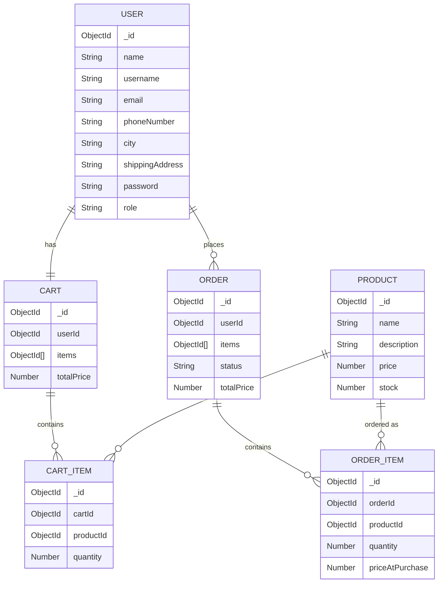

# Database Design

```mermaid
erDiagram
USER ||--|| CART : has
USER ||--o{ ORDER : places

    CART ||--o{ CART_ITEM : contains
    PRODUCT ||--o{ CART_ITEM : "added to"

    ORDER ||--o{ ORDER_ITEM : contains
    PRODUCT ||--o{ ORDER_ITEM : "ordered as"

    USER {
        ObjectId _id
        String name
        String username
        String email
        String phoneNumber
        String city
        String shippingAddress
        String password
        String role
    }

    CART {
        ObjectId _id
        ObjectId userId
        ObjectId[] items
        Number totalPrice
    }

    CART_ITEM {
        ObjectId _id
        ObjectId cartId
        ObjectId productId
        Number quantity
    }

    ORDER {
        ObjectId _id
        ObjectId userId
        ObjectId[] items
        String status
        Number totalPrice
    }

    ORDER_ITEM {
        ObjectId _id
        ObjectId orderId
        ObjectId productId
        Number quantity
        Number priceAtPurchase
    }

    PRODUCT {
        ObjectId _id
        String name
        String description
        Number price
        Number stock
    }
```
